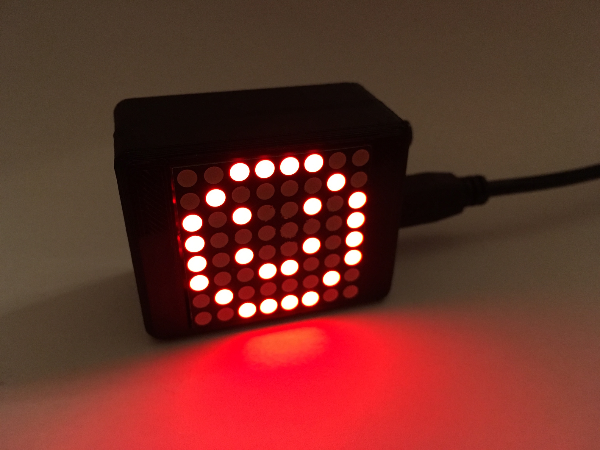
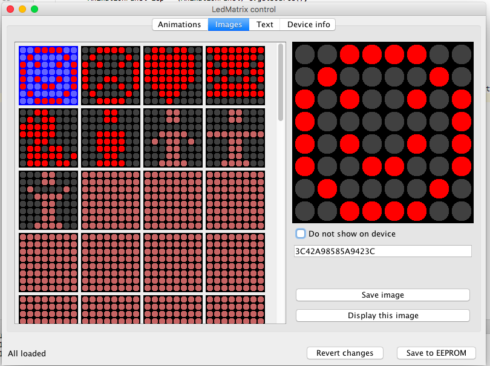

# Let's make: LedMatrix

Simple LED matrix driven by MAX7219 and Arduino Nano in nice small 3D printed case.
It can show images, animations and running text - all can be customized via desktop app.

* [3D prints](stl)
* [Firmware](firmware/lm-matrix) - uses Arduino Nano, no libraries needed
* [App](app) - requires Java 7, compiled by IntelliJ Idea Community Edition
* [Photos](pictures)

## How it looks

